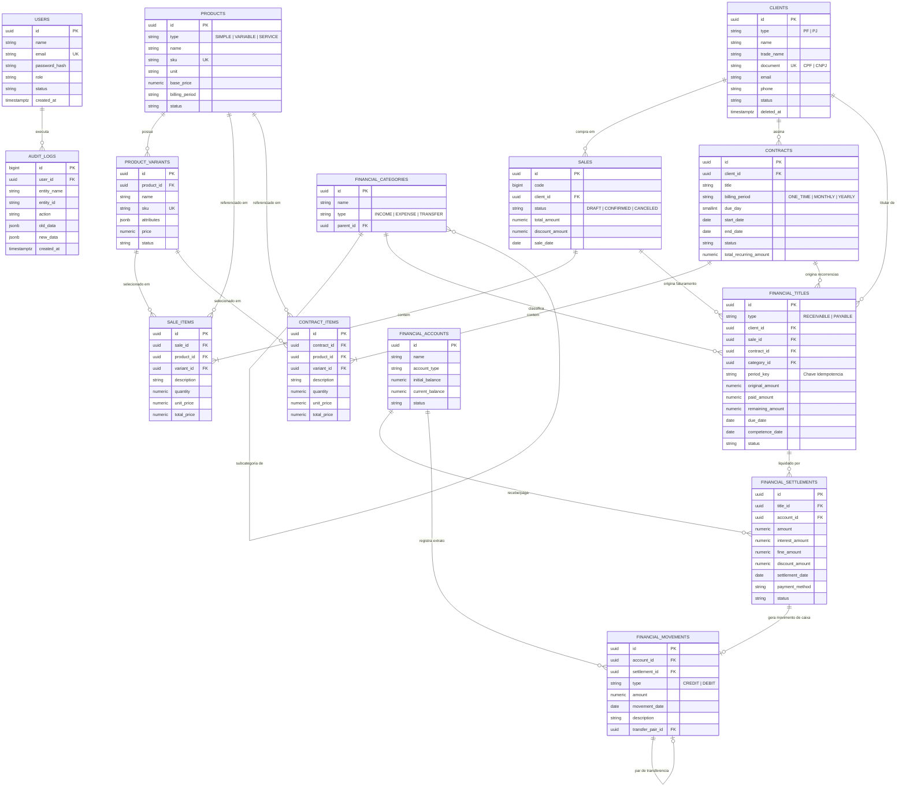

# Diagrama Entidade-Relacionamento (ERD)

Este documento apresenta a modelagem visual do banco de dados relacional do Sistema ERP em notação Mermaid.

```mermaid
erDiagram
    USERS ||--o{ AUDIT_LOGS : "executa"
    CLIENTS ||--o{ SALES : "compra em"
    CLIENTS ||--o{ CONTRACTS : "assina"
    CLIENTS ||--o{ FINANCIAL_TITLES : "titular de"
    
    PRODUCTS ||--o{ PRODUCT_VARIANTS : "possui"
    PRODUCTS ||--o{ SALE_ITEMS : "referenciado em"
    PRODUCTS ||--o{ CONTRACT_ITEMS : "referenciado em"
    PRODUCT_VARIANTS ||--o{ SALE_ITEMS : "selecionado em"
    PRODUCT_VARIANTS ||--o{ CONTRACT_ITEMS : "selecionado em"

    SALES ||--|{ SALE_ITEMS : "contem"
    SALES ||--o{ FINANCIAL_TITLES : "origina faturamento"

    CONTRACTS ||--|{ CONTRACT_ITEMS : "contem"
    CONTRACTS ||--o{ FINANCIAL_TITLES : "origina recorrencias"

    FINANCIAL_CATEGORIES ||--o{ FINANCIAL_CATEGORIES : "subcategoria de"
    FINANCIAL_CATEGORIES ||--o{ FINANCIAL_TITLES : "classifica"

    FINANCIAL_ACCOUNTS ||--o{ FINANCIAL_SETTLEMENTS : "recebe/paga"
    FINANCIAL_ACCOUNTS ||--o{ FINANCIAL_MOVEMENTS : "registra extrato"

    FINANCIAL_TITLES ||--o{ FINANCIAL_SETTLEMENTS : "liquidado por"

    FINANCIAL_SETTLEMENTS ||--o| FINANCIAL_MOVEMENTS : "gera movimento de caixa"
    FINANCIAL_MOVEMENTS ||--o| FINANCIAL_MOVEMENTS : "par de transferencia"

    USERS {
        uuid id PK
        string name
        string email UK
        string password_hash
        string role
        string status
        timestamptz created_at
    }

    AUDIT_LOGS {
        bigint id PK
        uuid user_id FK
        string entity_name
        string entity_id
        string action
        jsonb old_data
        jsonb new_data
        timestamptz created_at
    }

    CLIENTS {
        uuid id PK
        string type "PF | PJ"
        string name
        string trade_name
        string document UK "CPF | CNPJ"
        string email
        string phone
        string status
        timestamptz deleted_at
    }

    PRODUCTS {
        uuid id PK
        string type "SIMPLE | VARIABLE | SERVICE"
        string name
        string sku UK
        string unit
        numeric base_price
        string billing_period
        string status
    }

    PRODUCT_VARIANTS {
        uuid id PK
        uuid product_id FK
        string name
        string sku UK
        jsonb attributes
        numeric price
        string status
    }

    SALES {
        uuid id PK
        bigint code
        uuid client_id FK
        string status "DRAFT | CONFIRMED | CANCELED"
        numeric total_amount
        numeric discount_amount
        date sale_date
    }

    SALE_ITEMS {
        uuid id PK
        uuid sale_id FK
        uuid product_id FK
        uuid variant_id FK
        string description
        numeric quantity
        numeric unit_price
        numeric total_price
    }

    CONTRACTS {
        uuid id PK
        uuid client_id FK
        string title
        string billing_period "ONE_TIME | MONTHLY | YEARLY"
        smallint due_day
        date start_date
        date end_date
        string status
        numeric total_recurring_amount
    }

    CONTRACT_ITEMS {
        uuid id PK
        uuid contract_id FK
        uuid product_id FK
        uuid variant_id FK
        string description
        numeric quantity
        numeric unit_price
        numeric total_price
    }

    FINANCIAL_ACCOUNTS {
        uuid id PK
        string name
        string account_type
        numeric initial_balance
        numeric current_balance
        string status
    }

    FINANCIAL_CATEGORIES {
        uuid id PK
        string name
        string type "INCOME | EXPENSE | TRANSFER"
        uuid parent_id FK
    }

    FINANCIAL_TITLES {
        uuid id PK
        string type "RECEIVABLE | PAYABLE"
        uuid client_id FK
        uuid sale_id FK
        uuid contract_id FK
        uuid category_id FK
        string period_key "Chave Idempotencia"
        numeric original_amount
        numeric paid_amount
        numeric remaining_amount
        date due_date
        date competence_date
        string status
    }

    FINANCIAL_SETTLEMENTS {
        uuid id PK
        uuid title_id FK
        uuid account_id FK
        numeric amount
        numeric interest_amount
        numeric fine_amount
        numeric discount_amount
        date settlement_date
        string payment_method
        string status
    }

    FINANCIAL_MOVEMENTS {
        uuid id PK
        uuid account_id FK
        uuid settlement_id FK
        string type "CREDIT | DEBIT"
        numeric amount
        date movement_date
        string description
        uuid transfer_pair_id FK
    }
```
